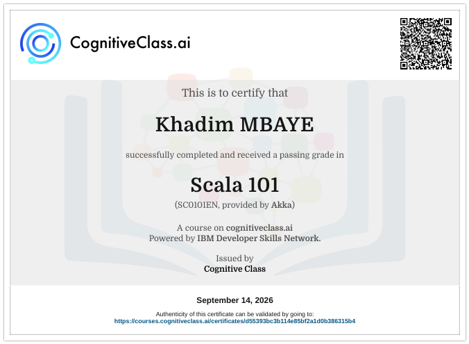

<div align="center">

<!-- 1. BANNER first — ASCII only (fixes ? diamond glyphs) -->


<!-- 2. CERTIFICATION — after banner, small border-radius -->


<br/><br/>

<!-- Official Scala logo — framed + rounded (#DC322F) -->


<br/>


<br/>


<br/><br/>


</div>

---

## Why this project exists

> **I am trying to put into practice what I have learned.**  
> ScalaBank is my hands-on playground: take course concepts, ship a real CLI banking system, and feel the difference between reading docs and writing code that runs.

<div align="center">

</div>

---

<table>
<tr>
<td width="58%" valign="top">

### What is ScalaBank?

A **command-line banking system** written in **Scala 3**.

Manage customers, accounts, deposits, withdrawals, and transfers — with an emphasis on:

- **Immutability** — no silent mutation of balances  
- **Functional style** — `Either`, pattern matching, enums  
- **Clear domain models** — accounts, customers, commands  

Built step by step from models → parser → storage → services → CLI.

</td>
<td width="42%" align="center" valign="middle">


</td>
</tr>
</table>

---

## Features in progress

| | Feature | Status |
|---|---|---|
| 01 | **Customers** — identity and credentials | Models ready |
| 02 | **Accounts** — Checking / Savings / Business | Models ready |
| 03 | **Transactions** — Deposit / Withdraw / Transfer | Commands ready |
| 04 | **CLI Parser** — raw text → typed `Command` | Done |

---

## Learning goals

I am deliberately practicing:

| Concept | Where it shows up |
|--------|-------------------|
| Case classes and enums | `Account`, `Customer`, `Devise`, `AccountType` |
| Enum ADTs | `Command`, `AccountStatut` |
| Pattern matching | `CommandParser` |
| `Either` for errors | Parse and validation pipeline |
| Immutability | Domain models + upcoming storage |
| Factory thinking | Model construction |

<div align="center">

</div>

---

## Project structure

```text
ScalaBank/
├── assets/
│   ├── scala.png                 # Certification
│   ├── scala-logo-framed.png     # Official logo, rounded frame
│   └── gifs/                     # Anime / manga (Giphy)
├── src/main/scala/models/        # package: me.khadimprojects
│   ├── Account.scala
│   ├── AccountStatut.scala
│   ├── AccountType.scala
│   ├── Command.scala
│   ├── CommandParser.scala
│   ├── Customer.scala
│   └── Devise.scala
├── build.sbt                     # Scala 3.9.0
└── README.md
```

---

## Domain snapshot

**Account** — number, balance, type, status, currency, customer, created_at  

**AccountType** — `CHECKING` | `SAVINGS` | `BUSINESS`  

**AccountStatut** — `ACTIVE` | `BLOCKED` | `CLOSED`  

**Devise** — `EUR` | `USD` | `XOF` | `GBP` | `JPY`  

**Command** (parser targets)

| Input style | Meaning |
|-------------|---------|
| `create <type> <devise>` | Open an account |
| `deposit <id> <amount>` | Credit |
| `withdraw <id> <amount>` | Debit |
| `transfer <from> <to> <amount>` | Move funds |
| `view account <id>` | Inspect one account |
| `all account` | List accounts |
| `transactions <id>` | History |
| `close <id>` | Close account |
| `exit` | Quit CLI |

---

## Run it

```bash
# clone
gh repo clone khadimmbaye0/scalabank
cd scalabank

# enter the REPL / compile
sbt compile
sbt console
```

> CLI loop and services are part of the learning roadmap — models + parser come first.

---

## Roadmap

```text
[x] Phase 1 — Domain models
[x] Phase 2 — Command parser (Either + matching)
[x] Phase 3 — Immutable in-memory storage
[ ] Phase 4 — Account / transfer services
[ ] Phase 5 — Reports
[ ] Phase 6 — Interactive CLI loop
```

---

## Stack

<p align="center">
  
</p>

<p align="center">
  <b>Scala 3.9.0</b> | sbt | Functional and immutable by design<br/>
</p>

---


